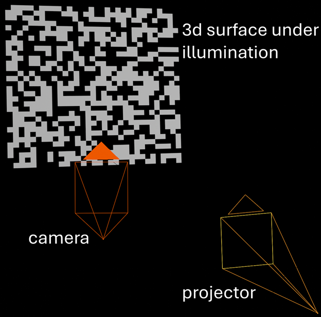

# Blender Projector–Camera Simulation (Displaced Plane + Pattern Projection)



This repo contains a minimal **Blender-based projector–camera setup** driven by a real calibration file. It builds a simple scene with:

* a **displaced plane** (from a grayscale height map),
* a **projector** that projects a pattern image onto the surface,
* a **camera** placed using OpenCV-style intrinsics/extrinsics,
* and an example **render output**.

The goal is to reproduce / validate real system geometry inside Blender and render what the calibrated camera would observe under projected illumination.

---

## What’s inside

```
.
├── slanted_plane.blend                     # Blender scene (main entry)
├── 11072025_final_calibration_summary.json # Real calibration summary (camera + projector)
├── pcs_setup_new_main_ver4.py              # Main script (Blender 4.x)
├── pcs_setup_new_main_ver5.py              # Main script (Blender 5.x)
├── pcs_setup_new_utils_ver4.py             # Utilities (Blender 4.x)
├── pcs_setup_new_utils_ver5.py             # Utilities (Blender 5.x)
├── heightmap0.png                          # Example displacement map (512×512, grayscale)
├── pattern_16.png                          # Example projected pattern (512×512, grayscale)
├── rgb_patches_16px.png                    # Example RGB pattern (512×512, RGB)
└── render_output.tiff                      # Example render output (928×928, RGB)
```

---

## Requirements

### Blender

This project supports **Blender 4.x and 5.x**, with version-specific entry scripts:

* **Blender 4.x**
  Use:

  * `pcs_setup_new_main_ver4.py`
  * `pcs_setup_new_utils_ver4.py`

* **Blender 5.x**
  Use:

  * `pcs_setup_new_main_ver5.py`
  * `pcs_setup_new_utils_ver5.py`

⚠️ Please make sure to use the script pair that matches your installed Blender version.

---

### Python Environment (Blender)

The scripts run inside **Blender’s built-in Python environment** and require:

* `numpy`
* `mathutils` (bundled with Blender)
* `bpy` (Blender Python API)

> **Note:**
> Some Blender builds do not ship with `numpy` enabled by default.
> If `numpy` is missing, install it into Blender’s Python environment or use a Blender distribution that already includes it.

---

### Blender Add-on (Required)

This project depends on the **Projectors** add-on for Blender:

🔗 [https://github.com/Ocupe/Projectors](https://github.com/Ocupe/Projectors)

Please install and enable the add-on in Blender before running the setup scripts.

---

## Quick start (Blender UI)

1. Open `slanted_plane.blend`
2. Go to **Scripting** workspace
3. Open the corresponding main script:

   * Blender 4.x → `pcs_setup_new_main_ver4.py`
   * Blender 5.x → `pcs_setup_new_main_ver5.py`
4. Click **Run Script**

The script will:

* load `11072025_final_calibration_summary.json`,
* load `heightmap0.png` and the selected pattern image,
* create the displaced plane + projector + camera,
* render a still image to the path specified by `scene.render.filepath`.

---

## Headless run (command line)

From the repo directory:

```bash
# Blender 4.x example
blender -b slanted_plane.blend -P pcs_setup_new_main_ver4.py

# Blender 5.x example
blender -b slanted_plane.blend -P pcs_setup_new_main_ver5.py
```

---

## Configuration

### Inputs / outputs

The scripts are designed around an `IOParams` dataclass (in the utils file) that defines:

* `height_map_filename` → default example: `heightmap0.png`
* `pattern_filename` → example: `pattern_16.png` (or `rgb_patches_16px.png`)
* `render_output_filename` → default: `render_output.tiff`

You can swap patterns by changing the filename in the main script (or wherever `IOParams(...)` is constructed).

### Camera / projector calibration

`11072025_final_calibration_summary.json` includes:

* camera intrinsics + distortion
* projector intrinsics + distortion
* world-to-camera and world-to-projector rotations
* camera/projector positions (notably used for Blender placement)
* reprojection errors (useful sanity checks)

Some example metrics in the file:

* camera mean reprojection error: **~0.209 px**
* joint calibration RMS: **~0.269**

> **Units note:** The JSON stores positions in **mm** in places (the scripts convert to meters using `* 1e-3`). Keep an eye on unit conversions if you replace the calibration file.

---

## What the utility code does

Key functions (see `pcs_setup_new_utils_ver*.py`):

* `opencv_extrinsics_to_blender_matrix(...)`
  Converts OpenCV-style extrinsics into a Blender world matrix (with optional axis convention conversion).

* `set_blender_camera_from_opencv(...)`
  Applies intrinsics (K) + sensor model / pixel pitch assumptions to match Blender camera parameters.

* `create_displaced_plane(...)`
  Builds a plane mesh and applies displacement using the grayscale height map.

* `create_projector(...)`
  Creates a projector-like object using emission/projection node setup and pattern texture.

* `setup_render(...)`
  Configures render settings and output path.

---

## Output

* The rendered image is written to `scene.render.filepath`.
* This repo includes an example output: `render_output.tiff` (928×928).

If you don’t see the output where you expect:

* check **Output Properties → Output → File Path**
* verify the script is calling `bpy.ops.render.render(write_still=True)`

---

## Common troubleshooting

* **`ModuleNotFoundError: No module named numpy`**
  Install numpy into Blender’s Python, or use a Blender distribution that includes it.

* **Textures look blurred / interpolated**
  The utils include `force_all_image_textures_nearest_interpolation(...)`. Ensure it’s being applied if you need exact pixel-level patterns.

* **Camera/projector orientation looks flipped**
  This is almost always **coordinate convention mismatch** (OpenCV vs Blender axes). Look for the flag `apply_cv2_to_blender_axes` inside the extrinsics conversion helper.

---

## Author

**Xiao Wang**
[xwang3@arizona.edu](mailto:xwang3@arizona.edu)
