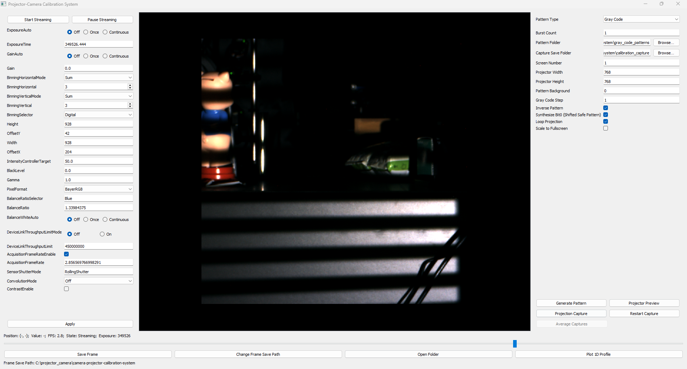

# Projector–Camera Control System  

  

**Figure:** Graphical user interface of the projector–camera control system.

This repository provides a **Python + PyQt–based GUI application** for controlling an **Allied Vision camera** (via **VmbPy / VimbaX**) and a **projector** operating as a fullscreen secondary display. The system supports structured-light pattern projection, synchronized image capture, projector–camera calibration, and offline 3D reconstruction.

The GUI enables **live camera preview**, **camera parameter control**, and **fullscreen pattern projection**, and provides a unified capture interface for both **calibration** and **reconstruction experiments**.

The following diagram summarizes the **end-to-end workflow** implemented in this repository, from GUI-based data acquisition to offline calibration and 3D reconstruction.
  
```
┌─────────────────────────────────────────────────────────────────────┐
│                   Projector–Camera Control System                   │
└─────────────────────────────────────────────────────────────────────┘
             │
             ▼
      [GUI] python main.py
             │
             ▼
      Start Streaming (Live Preview)
             │
             ▼
   Open Projector Window (Fullscreen)
             │
             ▼
        Choose Pipeline
     ┌───────┴───────────────────────────────┐
     │                                       │
     ▼                                       ▼
(A) Calibration Capture                  (B) Experiment Capture
Save → calibration_capture/              Save → projection_exp_capture/
      <CaptureID>/<session>/                   <CaptureID>/<session>/
     │                                       │
     ▼                                       ▼
Offline: proj_cam_calibration.ipynb      Offline: traditional_3d_reconstruction.ipynb
     │                                       │
     ├──────────────┐                        │
     ▼              │                        ▼
Outputs:            │              Uses calibration results:
- camera intrinsics │              - intrinsics / extrinsics
- extrinsics        │
- final summary     │                        ▼
- checkerboard poses└────────────────> Reconstruction Outputs:
                                   - decoded correspondences
                                   - pointcloud_camera / pointcloud_world
                                   - interpolated maps (.npy)
```

---

## Highlights

* **GUI-based live preview** with basic camera controls (exposure, gain, pixel format, binning).
* **Fullscreen projector pattern window** (intended for a secondary monitor / projector).
* **Projection–capture workflow**:
  * Select a **pattern folder** (Gray code, shifted bit-0, or user-defined image sequences)
  * Capture **multiple frames per pattern** (burst mode), saved into a structured session directory
  * Optional **capture averaging** to reduce sensor noise
* **Offline calibration** under `projector_camera_calibration/`:
  camera and projector intrinsic/extrinsic calibration, pose estimation, and plane fitting from calibration scenes
* **Offline 3D reconstruction** under `traditional_3d_reconstruction/`:
  Gray-code decoding and projector–camera triangulation (extendable to other structured-light patterns)
* **Gray-code pattern design for practical projector optics**:
  to address the limited modulation transfer and defocus of real projector optics at high spatial   frequencies, the system employs **step-wise Gray-code patterns** (effective pixel binning) and   **shifted bit-0 variants** to mitigate spatial aliasing and improve decoding robustness.


---

## Repository Layout

### Core application

* `main.py` — **GUI entry point**
* `viewer.py` — main PyQt window, live image viewer, and control panels
* `dialogs.py` — embedded configuration, calibration, and capture workflows
* `config.py` — default camera, projector, and capture settings
* `streaming.py` — camera streaming thread and buffer management
* `camera_feature_manager.py`, `camera_utils.py` — camera control wrappers (VmbPy)
* `project_pattern.py` — projector window and fullscreen pattern display
* `plot_1d_profile.py` — interactive 1D intensity profile tool
* `utils.py`, `global_state.py` — shared helpers and global state

### Patterns

* `gray_code_patterns/` — example Gray-code and shifted bit-0 patterns (PNG)

### Calibration and reconstruction

* `projector_camera_calibration/`

  * `calib_recon_utils.py` — calibration and reconstruction utilities
  * `proj_cam_calibration.ipynb` — projector–camera calibration notebook
* `traditional_3d_reconstruction/`

  * `decode_pattern.py` — Gray-code decoding utilities
  * `traditional_3d_reconstruction.ipynb` — reconstruction notebook

### Captured data (generated by the GUI)

* `calibration_capture/<date>/...` — **used for calibration**
* `projection_exp_capture/<date>/...` — **used for reconstruction**

---

## System Requirements

### Operating System

* **Windows is recommended**, as this is the typical and most stable workflow
  for **VimbaX / VmbPy**–based camera control.
* Most components of the codebase are cross-platform; however,
  **camera SDK–dependent modules** are constrained by vendor support.


### Hardware

* A **projector or secondary display**, used for fullscreen pattern projection
* An **Allied Vision camera** supported by **VimbaX + VmbPy**

#### Camera API Support and Extensibility

The current implementation provides a native camera control and streaming interface for **Allied Vision cameras** via **VmbPy / VimbaX**.

The camera interface is designed to be **modular and extensible**. Support for additional cameras (e.g., USB, GigE, industrial, or scientific cameras) can be added by implementing a compatible streaming and control wrapper that follows the existing abstractions in:

* `camera_utils.py`
* `streaming.py`

This design allows the GUI, projection workflow, and offline processing pipelines to remain unchanged when integrating new camera backends.

### Python Dependencies

Typical runtime dependencies include:

* `PyQt5`
* `numpy`
* `opencv-python` (or `opencv-contrib-python` if additional modules are required)
* `matplotlib`
* `scipy`
* `tqdm`
* `vmbpy`
* *(optional, for point-cloud processing)* `open3d`

> **Important:**  
> `vmbpy` requires a working installation of **Allied Vision VimbaX** and the corresponding camera drivers.


---

## Installation (recommended: Mamba)

```bash
mamba create -n projcam python=3.10 -y
mamba activate projcam

pip install PyQt5 numpy opencv-python matplotlib scipy tqdm
pip install vmbpy
# optional
pip install open3d
```

If you are using VimbaX:

* Install the Allied Vision VimbaX Runtime / Drivers
* Verify that the camera is visible in Allied Vision tools before launching the GUI

---

## Quickstart

### 1) Launch the GUI

From the repository root:

```bash
python main.py
```

This opens the main window.

### 2) Start camera preview (live streaming)

In the GUI:

1. Configure exposure time, pixel format, frame rate, pixel binning, and others if needed
2. Click **Start Streaming**

You should see the live camera feed updating in the viewer.

> If streaming fails, the issue is usually related to VimbaX/VmbPy installation, camera permissions, or another application holding the camera.

### 3) Open the projector pattern window

Pattern projection is handled by `project_pattern.py`.

Typical usage:

* Enable the projector display window from the GUI
* The pattern window opens fullscreen on the selected projector / monitor

**Tips**

* Ensure Windows display mode is set to **Extend**
* Use the projector as the secondary display
* If patterns appear on the wrong screen, adjust monitor selection in the GUI or configuration

---

## Pattern Selection

The GUI projection panel allows selecting a **pattern folder** that defines the
image sequence to be projected and captured.

In the embedded projection panel (`dialogs.py`), the following options are
available:

* **Pattern folder**: directory containing PNG/JPG pattern images
* **Browse…**: select an existing pattern directory
* **Use Customized Pattern**: enable projection and capture of user-defined patterns
* **Customized Pattern Folder**: directory containing a custom image sequence

### Pattern types

This repository currently provides built-in **Gray-code pattern sequences** under:

* `gray_code_patterns/`

These patterns are specifically designed for projector–camera structured-light reconstruction and include:

* horizontal and vertical Gray-code images with inverse patterns
* shifted bit-0 Gray-code variants for aliasing mitigation
* white and black reference patterns

In addition to the built-in Gray-code patterns, the GUI also supports **user-defined custom pattern folders**, allowing arbitrary image sequences to be projected and captured for experimentation.

### Gray-code generation, pixel binning, and shifted bit-0 variants

When **Gray code** is selected as the pattern type, the GUI provides a **Generate Pattern** button that allows users to synthesize Gray-code patterns with specific design options, including:

* enabling **Gray-code step / effective pixel binning**, which reduces the highest spatial frequency of the pattern sequence to better match the resolution of the camera–projector system;
* enabling **shifted bit-0 Gray-code variants**, which improve robustness under projector defocus and limited optical modulation transfer.

The shifted bit-0 approach works by projecting two low-frequency Gray-code patterns with a small spatial offset in the least significant bit and computing their difference to recover a higher-frequency effective pattern. This strategy mitigates spatial aliasing caused by projector optics and maintains reliable decoding accuracy under pixel binning or reduced projector optical performance.

---

## End-to-end Workflow

This repository implements **two distinct capture pipelines**, each serving a different purpose:

* **`calibration_capture/`**
  Used for **calibration** (intrinsics, extrinsics, checkerboard poses, etc.)

* **`projection_exp_capture/`**
  Used for **actual measurement and reconstruction experiments**
  (capturing structured-light patterns on objects and reconstructing geometry)

---

## Projection and Capture Workflow (GUI)

The projection–capture workflow provides a **general mechanism** for projecting image sequences and synchronously capturing camera frames.

This workflow is used for both:
* **Calibration data acquisition**  
* **Reconstruction experiment data acquisition**

depending on the selected output folder and subsequent offline processing.


### 1) Open the Projection panel

In the main GUI, open the panel created by:

* `create_projector_calibration_panel(...)`

Available controls typically include:

* **Capture Save Folder**
* **Burst Count**
* **Start Projection Capture**
* **Average Captures**
* **Pattern folder selectors**

### 2) Set output location

By default, captures are saved to:

```
<repo_root>/calibration_capture
```

(as defined in `config.py`). This can be changed in the GUI.

### 3) Set Capture Save Folder and Session Index

Use the **Browse** button next to **Capture Save Folder** in the GUI to select the output directory for projection capture data.

For each projection capture run, the captured images are saved to:

```
calibration_capture/<capture_save_folder>/<session_index>/
```

For example, if `<capture_save_folder>` is set to `12192025`, the directory structure will be:

```
calibration_capture/12192025/1/
calibration_capture/12192025/2/
calibration_capture/12192025/3/
...
```

The **session_index** is automatically incremented after each capture run. 
Click **Restart Capture** to reset the session index or specify a new starting index for subsequent projection captures


### 4) Set Burst Count

* Number of frames captured per projected pattern
* Files are saved as:

```
<pattern_stem>_00.png
<pattern_stem>_01.png
...
```

### 5) Start Projection Capture

For each pattern:

1. The pattern is displayed fullscreen on the projector
2. The camera captures `burst_count` frames
3. Images are saved into the session directory

---

## Output Folders

### 1) Calibration capture data

Generated by the GUI projection–capture workflow:  

```
calibration_capture/<CaptureID>/<session_index>/
```

This folder contains **raw captured images only**, which are later consumed by the calibration notebook.

Calibration result files such as:

* `*_camera_calibration_results.json / .npz`
* `*_final_calibration_summary.json`
* `*_checkerboard_poses_plotly.json`
* `visualize_corners_projector_*.png`

are generated **only after running** `projector_camera_calibration/proj_cam_calibration.ipynb`.


### 2) Experiment capture and reconstruction outputs

Raw experiment captures are generated by the GUI and stored under:  

```
projection_exp_capture/<CaptureID>/<session_index>/
```
3D reconstruction outputs such as:

* `pointcloud_camera.npy / .ply`
* `pointcloud_world.npy / .ply`
* interpolated maps:
  * `interp_depth_cam.npy`
  * `interp_height_world.npy`
  * `interp_rgb_albedo_*.npy`

are generated **only after running** `traditional_3d_reconstruction/traditional_3d_reconstruction.ipynb`.


---

## Projector–camera Calibration

Calibration must be completed **before reconstruction**.

### Calibration notebook

Open:

* `projector_camera_calibration/proj_cam_calibration.ipynb`

Typical steps:

1. Select a calibration session folder, e.g.

   ```bash
   calibration_capture/12192025
   ```  
2. Perform camera calibration (intrinsics, distortion)
3. Perform projector calibration and solve projector–camera geometry
4. Export calibration summaries:
   * `<CaptureID>_camera_calibration_results.json / .npz`
   * `<CaptureID>_final_calibration_summary.json`
   * `<CaptureID>_checkerboard_poses_plotly.json`

In addition to intrinsic and extrinsic calibration, the calibration notebook also **estimates an average calibration plane** by fitting a 3D plane model to the reconstructed checkerboard observations, which is useful for geometric validation and downstream analysis.

---

## 3d Reconstruction

Offline reconstruction uses **experiment data**, not calibration data.

Open:

* `traditional_3d_reconstruction/traditional_3d_reconstruction.ipynb`

### Typical workflow

1. Select an experiment session folder, e.g.

   ```
   projection_exp_capture/12192025/19/
   ```
2. Load captured Gray-code and inverse images
3. Decode projector correspondences using:

   * `traditional_3d_reconstruction/decode_pattern.py`
4. Use calibration results from the previous step to reconstruct:

   * camera-frame point clouds
   * world-frame point clouds (if extrinsics are available)
5. Optionally interpolate reconstructed data to dense maps:

   * depth, height, RGB albedo

> **Key dependency**:
> Calibration parameters come from `calibration_capture/`,
> while reconstruction images come from `projection_exp_capture/`.

Currently, the reconstruction pipeline implements **Gray-code–based structured-light reconstruction**. The design is modular and can be extended to support other pattern types, such as **sinusoidal fringe pattern**, by adding the corresponding decoding and phase-unwrapping modules.

---

## Common Issues

### Camera not detected / streaming fails

* Verify VimbaX installation and drivers
* Close other applications using the camera
* Confirm `vmbpy` works in the active environment

### Projector fullscreen on wrong monitor

* Ensure display mode is **Extend**
* Adjust projector screen selection in the GUI or configuration

---

## How to Cite / Acknowledge

If you publish results using this system, please cite your structured-light methodology and reference this repository as the control and capture pipeline.

---

## Author

**Xiao Wang**
[xwang3@arizona.edu](mailto:xwang3@arizona.edu)
